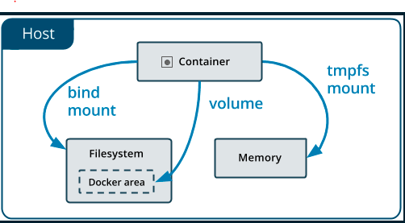
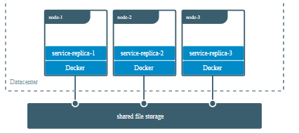

# Docker volume
- Có ba trường hợp sử dụng Docker Data Volumes:
  - Để giữ lai dữ liệu khi một container bị xóa
  - Để chia sẻ dữ liệu giữa các hệ thống tập tin máy chủ và container Docker
  - Để chia sẻ dữ liệu với các container Docker khác

- Docker hỗ trợ 2 option để lưu data ngay cả khi xóa container là volume và bind mounts. Trên linux có thể sử dụng thêm tmpfs mount.
  - Volumes: data sẽ nằm ở /var/lib/docker/volumes/ của Docker Host và được quản lý bằng Docker.
  - bind mounts: data có thể nằm ở bất kỳ đâu Docker Host, không được quản lý bởi Docker.
  - tmpfs mounts: Data sẽ được lưu vào memory của Docker Host và sẽ mất đi khi khởi động lại hoặc stop container.



## volumes
- Được tạo và quản lý bởi docker: `docker volume create`
- Một volume có thể được mount  với nhiều container đồng thời, khi container bị stop thì volume không bị xóa.
- Volume cũng support cơ chế của volume drivers, cho phép lưu trữ dữ liệu tới một server remote hoặc Cloud …
- Sử dụng volume khi:
  - Chia sẻ dữ liệu giữa nhiều container đang chạy. Các container có thể mount đòng thời tới cùng 1 volume (read-ony or read-write). 
  - Lưu dữ liệu tới một server remote hoặc cloud.
  - Khi cần backup, restore hoặc migrate dữ liệu từ Docker Host này sang Docker Host khác.
- volumes là lựa chọn tốt hơn việc lưu data trong container writable layer do volumes không làm tăng kích thước các container sử dụng
- `-v` or `--volume` được sử dụng cho standalone containers; `--mount` sử dụng cho swarm service (từ phiên bản 17.06 thì được sử dụng cho cả standalone containers)
- 

*ví dụ*

```sh
docker run -itd -v my-volume:/mount_point/ centos
# Hoặc 
docker run -itd --mount type=volume[bind;tmpfs],src=my-volume,dst=/opt/mount_point/,[readonly;volume-opt] centos
```

*command*

- `docker volume create my-vol`
- `docker volume ls`
- `docker volume inspect my-vol`
- `docker volume rm my-vol`
- `docker run -d \
  --name test \
  --mount source=myvol,target=/app \
  nginx`
  
*Lưu ý*
- Nếu mount một volume vào trong một thư mục của container, mà thư mục của container này đã có dữ liệu thì dữ liệu từ container sẽ được copy vào volume mount-point của docker host.
- Docker sẽ tự động tạo một volume và dữ liệu sẽ vẫn tồn tại khi container bị xóa.
- `--mount` chỉ hỗ trợ khi sử dụng mới swarm service
  
  ```sh
  docker service create -d \
  --replicas=4 \
  --name test-service \
  --mount source=myvol,target=/app \
  nginx
  ```

*Chia sẻ dữ liệu giữa các node*

- Khi xây dựng service trên nhiều node, để đảm bảo dữ liệu trả về khi có request đến đồng nhất trên các node, ta cần share volume.




## bind mounts
- Bind mounts trong Docker xuất hiện trước Volume. Bind mounts bị giới hạn một số các tính năng hơn so với volume. Binds mount có hiệu năng tốt nhưng bị phụ thuộc vào cấu trúc filesystem của Docker host
- Khi sử dụng bind mount thì một file hoặc một folder trong docker host được mount vào trong container. File hoặc Folder này yêu cầu đường dẫn tuyệt đối. Vậy nên, trong trường hợp file hoặc folder này không tồn tại trên docker host, thì quá trình mount sẽ bị lỗi.
- Bind mount được sử dụng khi:
  - Khi chia sẻ file cấu hình từ docker host với container.
  - Share source code giữa docker host và container
  - Khi cấu trúc tệp hoặc thư mục của máy chủ Docker được đảm bảo phù hợp các yêu cầu bind mount.
*Lưu ý*

- Khi sử dụng bind mounts và flag –mount thì phải đảm bảo file hoặc folder từ docker host đã được tồn tại. Không giống như volume, nếu folder trong Container “không trống” và được mount với folder của docker host thì tất cả các file trong folder của container sẽ bị ẩn đi

- `-v` và `--volume`: nếu thư mục chưa được tạo thì docker sẽ tự tạo thư mục. 
- `--mount`: Docker sẽ không tự tạo thư mục nếu nó chưa tồn tại.

*ví dụ*

```sh
$ docker run -d \
  -it \
  --name test \
  --mount type=bind,source=/opt/target,target=/app \
  nginx:latest
```
## tmpfs mounts
- Khi không muốn lưu data trên docker host hoặc bên trong container
- Khi muốn bảo mật, hoặc muốn đảm bảo hiệu suất container khi ứng dụng cần ghi một số lượng lớn dữ liệu không liên tục.
- tmpfs mount sẽ lưu dữ liệu tạm thời trên memory. Khi container stop, tmpfs mount sẽ bị xóa bỏ.
- `--tmpfs` và `--mount`