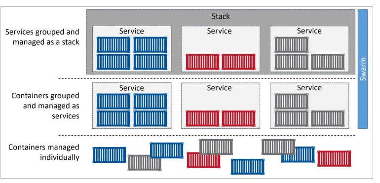
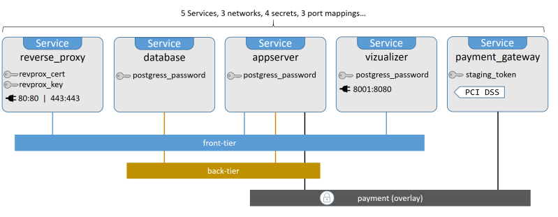

# Docker stack
- Docker Swarm đơn thuần điều phối các container chạy trên nhiều các docker host. Nhưng giữa các container đấy không có sự phụ thuộc lẫn nhau. Chính vì vậy, để liên kết các container ấy thành một ứng dụng chúng ta cần phải thao tác thủ công cho phép kết nối giữa chúng.
- Docker Compose là công cụ mà cho phép liên kết các container với nhau để chạy ứng dụng. Nhưng các container đấy lại chạy trên cùng một docker host. Vì vậy, nó sẽ có mặt hạn chế khi muốn high availability và horizontal scaling.
- Docker Stack, nó cho phép chúng ta kết hợp 2 công nghệ trên với nhau. Nó sử dụng tệp tin docker compose để định nghĩa, liên kết các container với nhau và chạy trong một cluster docker host (docker swarm). Nó cung cấp một cách đơn giản để triển khai và quản lý vòng đời của 1 ứng dụng: `initial deployment > health checks > scaling > updates > rollbacks`




*Ví dụ*
- Clone một app trên github về: `git clone https://github.com/dockersamples/atsea-sample-shop-app.git`
- Stack file:

```sh
version: "3.2"

services:
  reverse_proxy:
    image: dockersamples/atseasampleshopapp_reverse_proxy
    ports:
      - "80:80"
      - "443:443"
    secrets:
      - source: revprox_cert
        target: revprox_cert
      - source: revprox_key
        target: revprox_key
    networks:
      - front-tier

  database:
    image: dockersamples/atsea_db
    environment:
      POSTGRES_USER: gordonuser
      POSTGRES_DB_PASSWORD_FILE: /run/secrets/postgres_password
      POSTGRES_DB: atsea
    networks:
      - back-tier
    secrets:
      - postgres_password
    deploy:
      placement:
        constraints:
          - 'node.role == worker'

  appserver:
    image: dockersamples/atsea_app
    networks:
      - front-tier
      - back-tier
      - payment
    deploy:
      replicas: 2
      update_config:
        parallelism: 2
        failure_action: rollback
      placement:
        constraints:
          - 'node.role == worker'
      restart_policy:
        condition: on-failure
        delay: 5s
        max_attempts: 3
        window: 120s
    secrets:
      - postgres_password

  visualizer:
    image: dockersamples/visualizer:stable
    ports:
      - "8001:8080"
    stop_grace_period: 1m30s
    volumes:
      - "/var/run/docker.sock:/var/run/docker.sock"
    deploy:
      update_config:
        failure_action: rollback
      placement:
        constraints:
          - 'node.role == manager'

  payment_gateway:
    image: dockersamples/atseasampleshopapp_payment_gateway
    secrets:
      - source: staging_token
        target: payment_token
    networks:
      - payment
    deploy:
      update_config:
        failure_action: rollback
      placement:
        constraints:
          - 'node.role == worker'
          - 'node.labels.pcidss == yes'

networks:
  front-tier:
  back-tier:
  payment:
    driver: overlay
    driver_opts:
      encrypted: 'yes'

secrets:
  postgres_password:
    external: true
  staging_token:
    external: true
  revprox_key:
    external: true
  revprox_cert:
    external: true
```

**Kiến trúc của app như sau:**



*Triển khai đơn giản với command sau: `docker stack deploy *Compose file*`*

- Khi deploy, đầu tiên docker sẽ tạo một list các network khai báo trong stack file.
	- network: Mặc định thì tất cả network sẽ được tạo là overlay networl. `payment` network yêu cầu `encrypted` để mã hóa dataplane
	- secret: `external: true` chỉ ra rằng các secret phải tồn tại trước khi stack deploy. secret có thể được defind bởi 1 file chứa giá trị plaintext bằng cách thay thế `external: true` thành `file: <filename>`. Tuy nhiên điều này không được bảo mật.
	- services: 5 services được define.Khi deploy services với stack, image được yêu cầu phải là có sẵn.

*Để deploy stack với app trên, tham khảo thêm https://github.com/dockersamples/atsea-sample-shop-app.git *