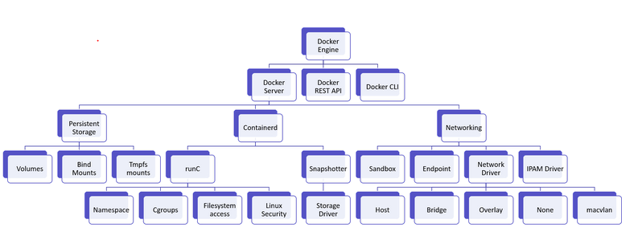

# Containerd

- Trái tim của hệ thống container là containerd. Nó là container runtime cho docker engine sử dụng để tạo và quản lý các container. Nó trừu tượng hóa các lời gọi tới chức năng cụ thể của system hoặc OS để chạy container trên windows, solaris và OS khác. Phạm vi của containerd bao gồm các thứ sau:
  - Create, start, stop, pause, resume, signal, delete một container
  - Chức năng cho overlay, aufs và copy-on-write file system khác cho các container
  - Build, push, pull images và quản lý các image
  - Persistent container logs

  

# Runc
- runC là 1 container runtime, runC được viết bằng Go, và nó tuân theo đặc tả của OCI. RunC sử dụng các công nghệ trong kernel Linux: namespaces, cgroups, apparmor/selinux để run container.