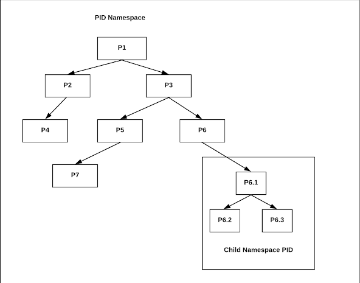
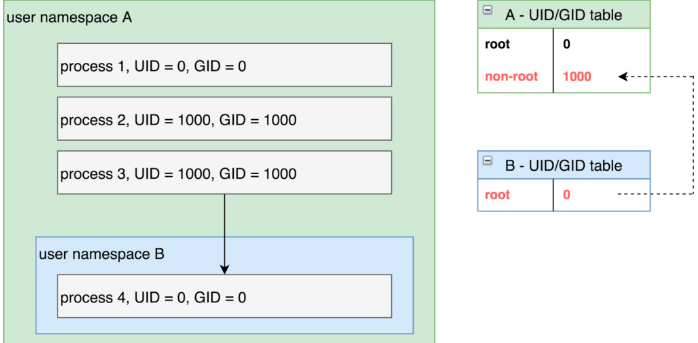
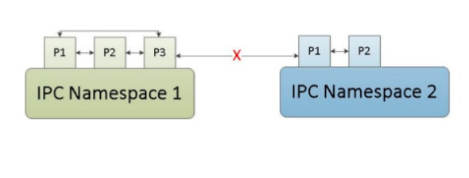

# Namespaces
- Docker sử dụng công nghệ namespace để cung cấp không gian làm việc cô lập cho container. Khi run một container, docker tạo 1 namespace cho container.
- Docker sử dụng các namespace sau trên Linux:
  - pid namespace: cô lập vùng số cấp cho ID của tiến trình
  - net namespace (Network namespace):cô lập giao diện mạng
  - ipc namespace (Inter-process Communication namespace): cô lập tài nguyên giao tiếp liên tiến trình
  - mnt namespace: cô lập các filesystem mount point
  - user namespace: cô lập về UID/GID
  - uts namespace: cô lập hostname và domainname.
  - Cgroup: cô lập về thư mục root của tính năng cgroups

## PID namespace
- Process namespace có thể có nhiều process tree lồng vào nhau. Mỗi process tree có thể có một bộ quy trình hoàn toàn độc lập. Điều này có thể đảm bảo rằng các process thuộc một process tree không thể kiểm tra hoặc kill hoặc thậm chí không thể biết được sự tồn tại của các process trong các process trees khác.
- Mỗi khời động Linux, nó khởi động chỉ bằng một process với PID=1. PID Namespace cho phép vào 1 proces tree mới với PID=1 của riêng nó. Quá trình này vẫn ở trong parent namespace, trong tree ban đầu, nhưng sẽ tạo ra một process tree riêng của nó.



- Khi Linux khởi động, nó khởi động bằng 1 process với PID=1
- Sau đó, từ PID=1 nó sinh ra các PID=2,3,4,5,6,..
- Ở đây ta thấy Process số 6 tạo 1 subtree tức là nó đang tạo 1 namespace khác. Trong namespace này, PID số 6 sẽ là parrent PID, các child process của PID 6 sẽ không thấy được các PID ở ngoài. Các PID bên ngoài vùng namespace này cũng không biết được sự hình thành và tồn tại của child PID Namesapce hay process tree này.

## net namespace 
- Network namspace cho phép bạn cô lập môi trường mạng network trong một host. Namespace phân chia việc sử dụng các khác niệm liên quan tới network như devices, địa chỉ IP, ports, định tuyến và các quy tắc tường lửa vào trong một hộp (box) riêng biệt, chủ yếu là ảo hóa mạng trong một máy chạy một kernel duy nhất.
- Network Namespace cho phép tạo ra network interface và có bảng định tuyến riêng, các thiết lập iptables riêng cung cấp cơ chế NAT và lọc đối với các máy ảo thuộc namespace đó.

*Thao tác với net namesacpe*
  
  - Liệt kê namespace: `ip netns` hoặc `ip netns list`
  - add namespace: `ip netns add ns1`

  Mỗi khi một namespace được tạo mới có một file tương ứng có cùng tên với tên của namespace tạo ra trong thư mục `/var/run/netns`. Lúc này

  ```sh
  [root@worker8 ~]# ls /var/run/netns/
  ns1
  ```

  - Thực thi lệnh trong namespace Để thực hiện các lệnh trong một namespace thì làm như sau: `ip netns exec <namespace> <command>` Ví dụ:

  	```sh
  	[root@worker8 ~]# ip netns exec ns1 ip a
	1: lo: <LOOPBACK> mtu 65536 qdisc noop state DOWN group default qlen 1000
    	link/loopback 00:00:00:00:00:00 brd 00:00:00:00:00:00
  	```

  	- Xóa namespace Xóa namespace sử dụng câu lệnh: `ip netns delete <namespace_name>`
  	- Network namespaces cho phép chạy các tiến trình trong network namespace. Ví dụ: chạy phiên bash trong một namespace: `ip netns exec <namespacwe> bash`

  	```sh
  	[root@worker8 ~]# ip netns exec ns2 bash
	[root@worker8 ~]# ip a
	1: lo: <LOOPBACK> mtu 65536 qdisc noop state DOWN group default qlen 1000
    	link/loopback 00:00:00:00:00:00 brd 00:00:00:00:00:00
    [root@worker8 ~]# exit
	exit
  	```

  	- Add `interfaces` vào network namespaces: `ip link set <interface_name> netns <namespace_name>`

  	Tạo các interface ảo veth0 và veth1: `ip link add veth0 type veth peer name veth1`

  	Đính kèm veth1 vào ns1 namespace :`ip link set veth1 netns ns1`, `ip netns exec ns1 ip link set dev veth1 up`

  	veth0 vẫn đính kèm với global namesapce: ` ip link set dev veth0 up`

  	configure địa chỉ IP cho các virtual interface:

  	```sh
  	[root@worker8 ~]# ip addr add 10.0.0.1/24 dev veth0
	[root@worker8 ~]# ip netns exec ns1 ip addr add 10.0.0.2/24 dev veth1
  	``` 

  	ping test: 
  	```sh
	[root@worker8 ~]# ip netns exec ns1 ping 10.0.0.1
	PING 10.0.0.1 (10.0.0.1) 56(84) bytes of data.
	64 bytes from 10.0.0.1: icmp_seq=1 ttl=64 time=0.049 ms
	64 bytes from 10.0.0.1: icmp_seq=2 ttl=64 time=0.085 ms
	64 bytes from 10.0.0.1: icmp_seq=3 ttl=64 time=0.056 ms
	64 bytes from 10.0.0.1: icmp_seq=4 ttl=64 time=0.099 m
  			   ```

**Trong docker**
- Lấy pid của container: `docker inspect --format {{.State.Pid}} <container_name_or_ID>`
- Ta thực hiện truy cập vào network namespace của container có PID là `5071`: `nsenter --target 5071 --net`

```sh
[root@worker8 ~]# nsenter --target 5071 --net
[root@worker8 ~]# ip a
1: lo: <LOOPBACK,UP,LOWER_UP> mtu 65536 qdisc noqueue state UNKNOWN group default qlen 1000
    link/loopback 00:00:00:00:00:00 brd 00:00:00:00:00:00
    inet 127.0.0.1/8 scope host lo
       valid_lft forever preferred_lft forever
8: eth0@if9: <BROADCAST,MULTICAST,UP,LOWER_UP> mtu 1500 qdisc noqueue state UP group default 
    link/ether 02:42:ac:11:00:02 brd ff:ff:ff:ff:ff:ff link-netnsid 0
    inet 172.17.0.2/16 brd 172.17.255.255 scope global eth0
       valid_lft forever preferred_lft forever
```

- Ta có thể truy cập vào container bởi:`nsenter --target $PID --mount --uts --ipc --net --pid`   

## User namespace
- User Namespace được sử dụng để cô lập UID và GID giữa máy chủ và containers làm tăng tính bảo mật: Nó có thể là root của Namespace này nhưng lại là non-root ngoài namespace.
- User ID và Group ID của một process có thể khác nhau giữa bên trong và bên ngoài một User Namespace.  



## IPC Namespace


- IPC Namespace là việc cô lập các tài nguyên giao tiếp giữa các process bên trong của các IPC Namespace khác nhau.

## mount namespace
- Mount Namespace cô lập danh sách các mountpoint được nhìn thấy bởi các process trong mỗi namespace. Do đó, các process trong mỗi trường hợp Mount Namespace sẽ thấy các cấu trúc thư mục đơn riêng biệt. 
- Mount Namespace tránh tiết lộ bất kỳ thông tin nào về cấu trúc hệ thống.
- Bạn có thể xem tất cả các hệ thống tệp được gắn trong mounts namespaces thông qua `/Proc/[pid]/mounts`

## UTS Namespace
- UTS Namespace là một namespace để cô lập các thiết lập liên quan đến hostname và domainname nhận diện của hệ thống
- Lệnh unshare cho phép chạy một chương trình với một số namespace và "không chia sẻ" với parent của nó, có nghĩa là unshare sẽ chạy bất kỳ chương trình nào trong một namespace.

```sh
[root@worker8 ~]# hostname
worker8
[root@worker8 ~]# unshare -u /bin/bash
[root@worker8 ~]# hostname test01
[root@worker8 ~]# hostname
test01
[root@worker8 ~]# exit
exit
[root@worker8 ~]# hostname
worker8
[root@worker8 ~]#

```

# Control group
- Control group hay cgroup cho phép bạn có thể cấp phát tài nguyên – như thời gian sử dụng CPU, RAM, Network. Bạn có thể theo dõi Cgroups, từ chối Cgroups sử dụng tài nguyên nhất định và ngay cả việc cấu hình lại Cgroups trên một hệ thống đang chạy.
- Trong cgroups, các tài nguyên hệ thống được gọi bằng thuật ngữ `“subsystem”` hay `“resource controller”` và các tiến trình trên hệ thống được gọi là “task”. Các `resource controller` này được lưu trong: `/sys/fs/cgroup`
- Việc chia sẻ tài nguyên phần cứng hiệu quả giữa các người dùng sẽ tăng khả năng ổn định của hệ thống.
- Docker cũng sử dụng kernel control group để phân bổ và cô lập resource.Một cgroup giới hạn một ứng dụng cho một tập resource nhất định. Control groups cho phép Docker Engine chia sẻ những tài nguyên phần cứng cho các containers và cũng có thể đảm bảo giới hạn những tài nguyên này hay thiết lập các constraints.
- Docker sử dụng cgroups để giới hạn memory, cpu của container.
- Các subsystem phổ biến trên cgroups:
	- cpu: sử dụng OS scheduler để cấp phát CPU cho các “task”.
	- cpuacct: báo cáo về trình trạng sử dụng CPU của các “task”.
	- cpuset: giới hạn việc sử dụng số lượng CPU trên hệ thống nhiều CPU.
	- memory: giới hạn việc sử dụng bộ nhớ hệ thống.
	- blkio: giới hạn việc truy cập nhập/xuất(I/O) đến các thiết bị như ổ đĩa cứng.
	- net_prio: giới hạn băng thông mạng theo độ ưu tiên.
	- pids: giới hạn số lượng process được tạo.

Ví dụ:
- Giới hạn tốc độ đọc 1mb/s cho container: `docker run -it --device-read-bps /dev/sda:1mb centos`
- Kiểm tra: 

```sh
[root@7-0-0-66 c57b145e32c5cee9cc95a8d9c775fbee6070d0e998eb75f1a6401bbaa527c521]# cat blkio.throttle.read_bps_device 
8:0 1048576
```


# Tham khảo
- https://8gwifi.org/docs/linux-namespace.jsp
- https://techzones.me/linux/linux-network-namespace/
- https://cloudfun.vn/threads/lam-the-nao-cac-container-cach-ly-cac-qua-trinh-su-dung-linux-namespaces.155/
- https://platform9.com/blog/container-namespaces-deep-dive-container-networking/
- http://jpetazzo.github.io/2014/06/23/docker-ssh-considered-evil/
- https://shekhargulati.com/2019/01/03/how-docker-uses-cgroups-to-set-resource-limits/