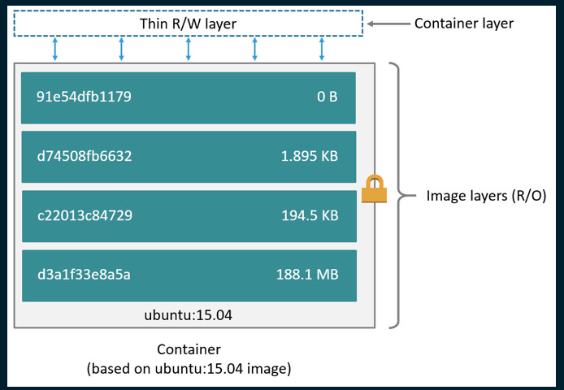
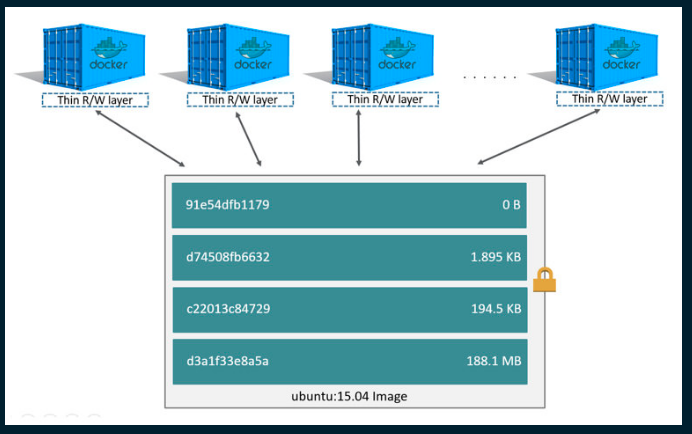
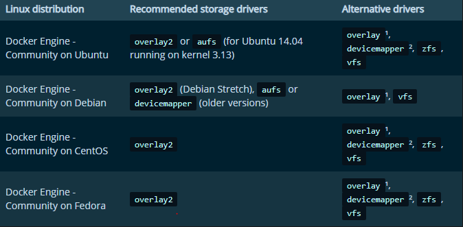
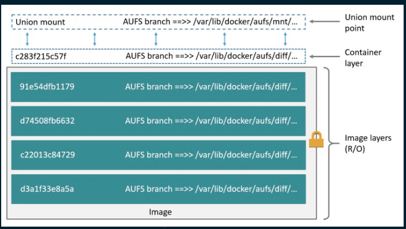

- Storage driver kiểm soát cách image và container được lưu trữ và quản lý trên Docker host.
- Storage drivers cho phép create data trong một writable container layer.
- Các files sẽ không được lưu lại sau khi mà container stops. Ta nên sử dụng docker volume thay vì ghi dữ liệu vào container layer.

# Image vs container
- Docker image được build từ các layer. Mỗi layer tương ứng với 1 dòng chỉ thị trong Dockerfile. Ví dụ:

```sh
FROM ubuntu:15.04
COPY . /app
RUN make /app
CMD python /app/app.py
```

*Docker file bên trên bao gồm 4 commands và mỗi command này sẽ tạo ra một layer. Mỗi một layer chỉ là một phần khác biệt so với layer phía trước nó. Mỗi layer sẽ được xếp lên trên layer trước nó. Khi tạo một container mới thì ta đã tạo ra một writeable layer on top of the underlying layers - một layer có thể ghi được đặt trên cùng so với những layer thuộc images mà container này được tạo ra và được gọi là container layer.*



# Container and layers
- Sự khác biệt lớn nhất giữa container và image là writable layer trên cùng. Tất cả những thay đổi mà bạn thực bên trong container sẽ được lưu lại và layer có thể ghi này. Khi container bị xóa chúng cũng bị xóa theo và quay trở lại trạng thái unchanged (là bản mới sau khi vừa được build ra từ image).
- Mỗi container sẽ có writable container layer riêng, tất cả thay đổi được lưu tại layer này. Nhiều container có thể truy cập vào cùng một image nếu chúng được tạo ra từ image này và chúng sẽ có trạng thái riêng.



- Docker sử dụng storage driver để quản lý nội dung của image layer và writable container layer. Mỗi storage driver xử lý các việc implement khác nhau nhưng các driver sử dụng các image layer xếp chồng lên nhau và `copy-on-write (CoW) strategy`.
- `copy-on-write (CoW)` là một cách chia sẻ và sao chép file để đạt hiệu suất tối đa. Nếu 1 file hoặc thư mục tồn tại ở lower layer trong image layer và một layer khác cần truy cập vào nó, nó sẽ sử dụng file đã tồn tại. Khi running container, file sẽ được coppy vào layer đó và sửa đổi

- Khi sử dụng `docker pull` để pull image xuống từ repository hoặc khi tạo container từ một image không có sẵn trên host, mỗi layer sẽ được pull xuống riêng biệt và lưu trữ trong storage local của docker (`/var/lib/docker`)

```sh
$ docker pull ubuntu:18.04
18.04: Pulling from library/ubuntu
f476d66f5408: Pull complete
8882c27f669e: Pull complete
d9af21273955: Pull complete
f5029279ec12: Pull complete
Digest: sha256:ab6cb8de3ad7bb33e2534677f865008535427390b117d7939193f8d1a6613e34
Status: Downloaded newer image for ubuntu:18.04
```

- Mỗi layer sẽ được lưu trong thư mục riêng của nó bên trong local storager của docker. Để xem các layer trên filesystem, liệt kê nội dung của `/var/lib/docker/<storage-driver>`. Ví dụ với overlay2:
	```sh
	$ ls /var/lib/docker/overlay2
	16802227a96c24dcbeab5b37821e2b67a9f921749cd9a2e386d5a6d5bc6fc6d3
	377d73dbb466e0bc7c9ee23166771b35ebdbe02ef17753d79fd3571d4ce659d7
	3f02d96212b03e3383160d31d7c6aeca750d2d8a1879965b89fe8146594c453d
	ec1ec45792908e90484f7e629330666e7eee599f08729c93890a7205a6ba35f5
	l
	```


# Choose the best storage driver
- Docker hỗ trợ các  storage driver sau:
  - overlay2: là storage driver được dùng nhiều nhất cho các bản phân phối Linux, không yêu cầu cấu hình bổ sung. Khi cài đặt Docker lần đầu tiên, overlay2 được sử dụng mặc định.
  - aufs: sử dụng nhiều cho Docker version 18.06 or cũ hơn. trước kia, aufs là storage driver mặc định. Tuy nhiên bây giờ để sử dụng nó, ta phải cấu hình rõ rằng và cần các gói bổ sung như: `linux-image-extra` 
  - devicemapper: được recommend cho CentOS và RHEL do kernel không hỗ trợ overlay2. Tuy nhiên hiện nay các phiên bản Centos và rhel đã hỗ trợ overlay2.
  - brtfs or zfs: được sử dụng nếu filesystem trên Docker host là hệ thống tệp backup. Cho phép tạo snapshots. brtfs  và zfs đòi hỏi nhiều bộ nhớ. 
  - vfs: dược dùng cho mục đích thử nghiệm

  

## AUFS
- Như đã đề cập ở trên, aufs trước đây là storage driver mặc định để quản lý image và layer on ubuntu, debian . Nếu Linux kernel >=4.0 và sử dụng Docker CE, ta có thể sử dụng overlay2 với nhiều ưu điểm hơn.
- Yêu cầu:
  - Với docker CE, aufs hỗ trợ với ubuntu và debian version < Stretch.
  - Với docker EE, aufs support ubuntu.
  - Nếu sử dụng ubuntu, ta cần add aufs module vào kernel. Nếu không ta sẽ sử dụng overlay2.
- aufs là một union filesystem, nó cho phép nhiều thư mục có thể nằm chống lên nhau và hiển thị dưới 1 thư mục duy nhất. Các thư mục này được gọi là branches trong aufs và layer trong docker. Qua trình gắn kết lại được gọi là `union mount`. 



*Mỗi image layer, container layer được biểu diễn trên docker host dưới dạng các subfoler của /var/lib/docker. Tên của folder không phải là ID của các layer*

- Check hệ thống có support aufs không: `$ grep aufs /proc/filesystems`. Nếu kết quả `nodev   aufs` tức là hệ thống có hỗ trợ. Do overlay2 là mặc định nên để sử dụng aufs ta cần cấu hình như sau:
	- `systemctl stop docker`
	- Tạo file `/etc/docker/daemon.json` và thêm vào 

	```sh
	{
  		"storage-driver": "overlay2"
	}
	```

	- `systemctl start docker`
	- Kiểm tra lại xem đã thay đổi được storage drvier chưa với `docker info`.

	```sh
		root@ubuntu:/home/dungla# docker info
		Client:
 		  Debug Mode: false
		Server:
 		  Containers: 0
  		   Running: 0
  		   Paused: 0
  		   Stopped: 0
 		  Images: 1
 		  Server Version: 19.03.9
 		  Storage Driver: aufs
  		  Root Dir: /var/lib/docker/aufs
  		   Backing Filesystem: extfs
  		   Dirs: 4
  		   Dirperm1 Supported: true
 		 Logging Driver: json-file
 		 ........................
	```

- `image layer`: Tất cả thông tin về image và contianer layer được lưu trong `/var/lib/docker/aufs/`
	- diff/: nội dung của mỗi layer, mỗi layer được lưu trữ trong một thư mục con riêng
	- layer/: metadata về cách các image-layer được xếp chồng lên nhau. Thư mục này chứa 1 file cho mỗi image-layer hoặc container-layer chứa trên Docker-host. Mỗi file chứa ID của tất cả các layer bên dưới nó trong stack (cha mẹ của nó).
	- mnt/: Mount points, một điểm trên mỗi image-layer hoặc container-layer, được sử dụng để lắp ráp và gắn kết filesystem thống nhất cho một container. Đối với image chỉ đọc, các thư mục này luôn trống.
- `container layer`: 
	- `diff/`:  Sự khác biệt được giới thiệu trong layer container có thể ghi, chẳng hạn như các tệp mới hoặc sửa đổi.
	- `layer/`: Metadata về container-layer có thể ghi của lớp cha mẹ.
	- `mnt/`: Một điểm gắn kết cho mỗi container đang chạy filesystem thống nhất, chính xác như nó xuất hiện từ bên trong container.

## OverlayFS
## 1.Overlay2
- Các thư mục này được gọi là các layer và tiến trình hợp nhất được gọi là union mount. OverlayFS đề cập đến thư mục thấp hơn là lowerdir và thư mục cao hơn là Upperdir. Chế độ xem thống nhất được hiển thị thông qua thư mục riêng được gọi là merged.

Overlay2 hỗ trợ tối đa 128 OverlayFS layer. Khả năng này cung cấp hiệu suất tốt hơn cho các lệnh Docker liên quan đến layer Docker build và Docker commit và tiêu thụ ít inodes hơn trên backing filesystem.

- OverlayFS được hỗ trợ nếu đáp ứng yêu cầu:
	- `overlay2` driver được hỗ trợ trên Docker CE và docker EE 17.06.02-ee5 và nó là recommend
	- Version 4.0 hoặc lớn hơn của Linux kernel. RHEL or CentOS sử dụng kernel version >=3.10.0-514. Các version cũ hơn sẽ sử dụng overlay driver.
- Overlay2:
	- OverlayFS gồm có `lowerdir` và `upperdir`. Hiển thị hợp nhất dưới 1 thư mục riêng gọi là `merged`.
	- Overlay2 hỗ trợ 128 lower OverlayFS layers
	- Thư mục `l` trong `/var/lib/docker/overlay2` chứa  các định danh layer rút ngắn làm symbolic links.
	- Layer thấp nhất chứa file gọi là link,chứa tên của mã định danh được rút ngắn và một file có tên là diff chứa nội dung layer.  1 thư mục `diff` chứa nội dung của layer. Layer thấp nhất thứ 2 và các layer cao hơn được gọi là `lower` 